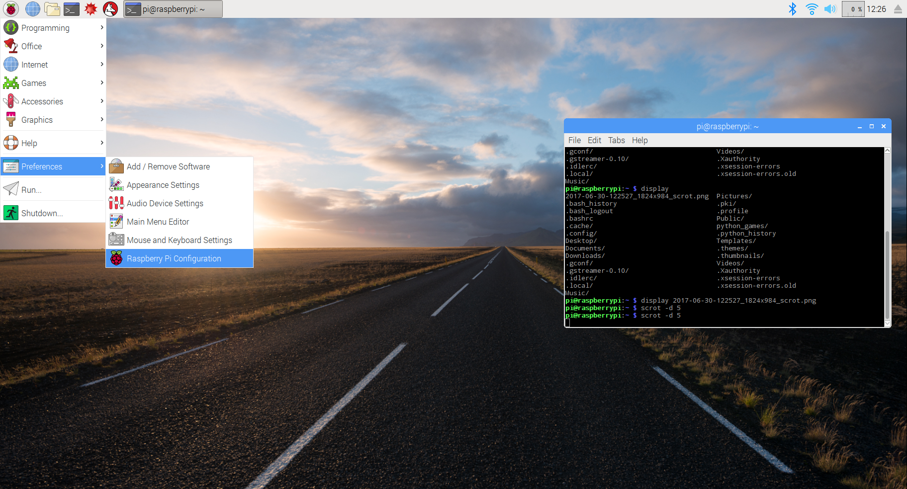
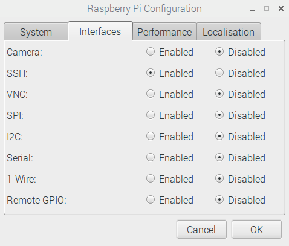
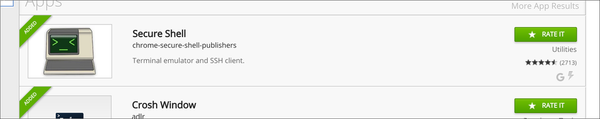
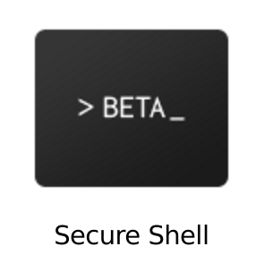
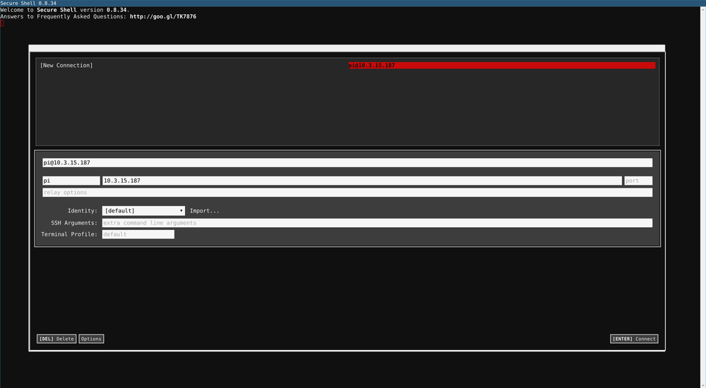
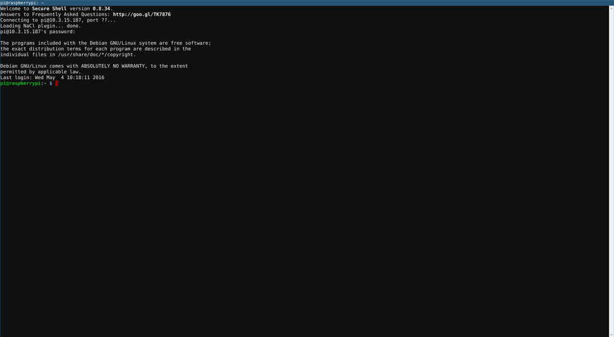
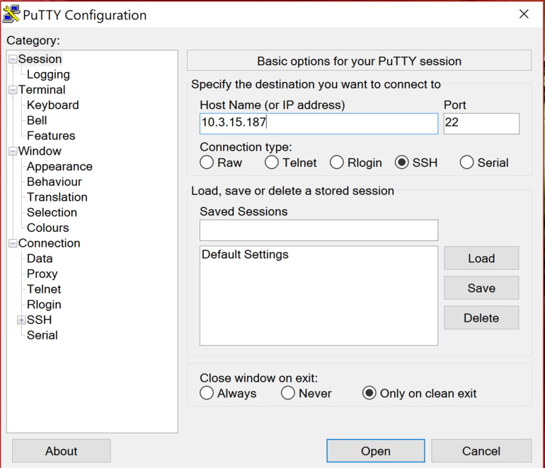
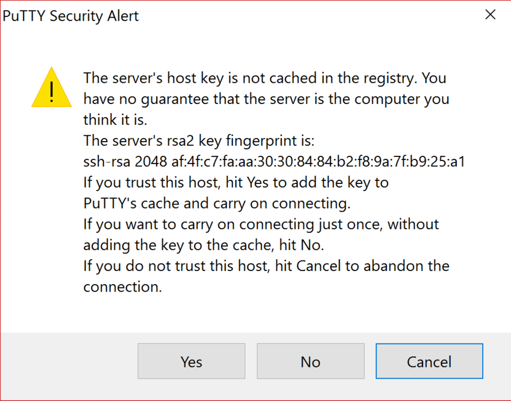
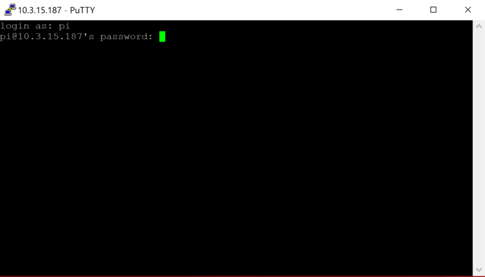

You can access a remote terminal on your Raspberry Pi using the Secure Shell tool (SSH).

SSH is disabled by default on the Raspberry Pi, so you will first need to eenable it.

- Click on `Menu` --> `Preferences` --> `Raspberry Pi Configuration`

	

- Click on the `Interfaces` tab. Then check the radio button next to `SSH` to enable it.

	

- Click `OK` to finish.

- To find the IP address of your Raspberry Pi, you can open a terminal and type:

	```bash
	hostname -I
	```
- As you have now enabled SSH, it might be a good idea to change your password. Open up a terminal and type:

	```bash
	passwd
	```

Now you can access your Raspberry Pi via SSH from another networked computer, using the instructions below.

### Nix-based operating systems

- If your are using OS X or a Linux-based OS, then SSH is native to the operating system. 

- Open a terminal and type:

	``` bash
	ssh pi@10.10.10.10
	```

- Don't forget to replace 10.10.10.10 with the IP address of the Raspberry Pi.

- Then you can type in the password when prompted; it is usually `raspberry` unless you have changed it.

### Chrome OS and Chrome browser

- If you are using Chrome OS or have access to the Chrome browser, then there's a Chrome app that allows access over SSH. You can find the Secure Shell App in the [Chrome Web Store](https://chrome.google.com/webstore/detail/secure-shell/pnhechapfaindjhompbnflcldabbghjo?hl=en).

	

- Once installed, click on the app to open it:

	

- Now you can access the Raspberry Pi by typing in the IP address:

	

- Then type in the password:

	

### PuTTY (on Windows)

- PuTTY is an app that provides SSH access on Windows.

- Download PuTTY from [this site](http://www.chiark.greenend.org.uk/~sgtatham/putty/download.html){:target="_blank"}.

- Once installed, you can open PuTTY from the Start menu and type in the IP address:

	

- If it's your first time connecting to this Raspberry Pi, you'll get a warning dialogue box, so click `Yes` to connect:

	

- Then you need to enter the username and password for the Raspberry Pi (usually `pi` and `raspberry`):

	
